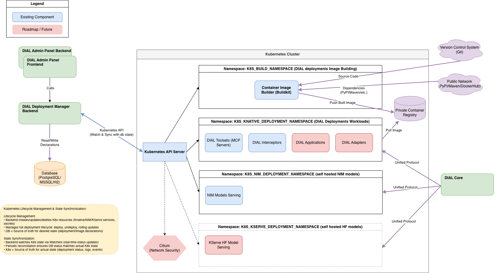

# DIAL Deployment Manager Backend

[](https://www.oracle.com/java/technologies/javase/jdk21-archive-downloads.html)
[](https://spring.io/projects/spring-boot)
[](LICENSE)

Backend service module that extends the [AI DIAL Admin Panel](https://github.com/epam/ai-dial-admin-backend), simplifying and democratizing the building and deployment of AI applications and deployments inside Kubernetes. This service is deployed alongside the main admin app and is used by both the admin backend and frontend (feature-flagged).

The DIAL Deployment Manager Backend makes complex Kubernetes-based AI deployments accessible without requiring deep Kubernetes expertise. It provides a streamlined interface for managing container image builds, deployments, and lifecycle operations for AI workloads.

**Current Focus:**
- MCP (Model Context Protocol) servers
- DIAL interceptors
- NIM support for simplified inference deployment

**Roadmap:**
- KServe support for simplified inference deployment
- Agile network rules management in untrusted clusters
- DIAL adapters
- DIAL applications

For more information about the parent AI DIAL Admin Panel, visit the [ai-dial-admin-backend repository](https://github.com/epam/ai-dial-admin-backend) or [DIAL Documentation](https://docs.dialx.ai/).

## Table of Contents

- [Prerequisites](#prerequisites)
- [Features](#features)
- [Configuration](#configuration)
- [Getting Started](#getting-started)
- [Deploying NVIDIA NIM Models](#deploying-nvidia-nim-models)
- [Security](#security)
- [Contributing](#contributing)
- [License](#license)
- [Documentation](#documentation)

## Prerequisites

- Java 21 or higher
- Gradle 7.x or higher
- Docker and Docker Compose (for containerized deployment)
- Kubernetes cluster (for production deployments)
- Database (H2/PostgreSQL/SQL Server) - H2 is sufficient for local development

## Features

- **MCP Deployment Management**: Complete lifecycle management for Model Context Protocol servers
- **Container Image Building**: Automated image building with Kaniko in Kubernetes jobs
- **Image Definition Management**: Support for multiple image definition types (MCP, DIAL Interceptor) with versioning
- **Knative-Based Deployments**: Serverless container deployments with auto-scaling and automatic HTTPS endpoints
- **Real-Time Status Updates**: Server-Sent Events (SSE) for real-time build status and deployment monitoring
- **Kubernetes Event Streaming**: Real-time event streaming for deployment monitoring and troubleshooting
- **Disposable Resource Management**: Automatic tracking and cleanup of Kubernetes resources with lifecycle state management
- **Multi-Database Support**: Flexible database options (H2, PostgreSQL, SQL Server) for different deployment scenarios
- **Multiple Authentication Methods**: Support for JWT and Basic Auth authentication
- **Identity Providers Support** Integration of different providers (Keycloak, AzureAD and others) for identity management
- **Health Monitoring**: Comprehensive health checks and metrics endpoints (Prometheus)
- **Private Registry Support**: Support for private Git repositories and Docker registries in image builds
- **Environment Variable Management**: Sophisticated handling of environment variables with automatic conversion of sensitive vars to Kubernetes Secrets

## Configuration

Complete list of configuration properties can be found in the [Configuration Documentation](docs/configuration.md).

### Key Configuration Areas

- **Kubernetes Connection**: Configure via config file (`K8S_CONNECT_TYPE=CONFIG_FILE`) or token-based authentication (`K8S_CONNECT_TYPE=TOKEN`)
- **Docker Registry**: Configure registry URL, protocol, and authentication (`DOCKER_REGISTRY`, `DOCKER_REGISTRY_AUTH`)
- **Database**: Support for H2, PostgreSQL, and SQL Server via `DATASOURCE_VENDOR` environment variable
- **Security/Authentication**: Configure via `CONFIG_REST_SECURITY_MODE` (none, basic, oidc)
- **Knative Deployment**: Configure namespaces, timeouts, and scaling parameters
- **Build Pipeline**: Configure build namespaces, images, and resource limits

### Environment Variables

The application supports extensive configuration via environment variables. See [Configuration Documentation](docs/configuration.md) for the complete list.

## Getting Started

### Run Application with Gradle

From the project's root directory:

```bash
./gradlew bootRun
```

### Run with Docker

#### Build Docker Image

```bash
docker build -t aidial/ai-dial-admin-deployment-manager-backend:latest .
```

#### Run Container

```bash
docker run -p 8080:8080 aidial/ai-dial-admin-deployment-manager-backend:latest
```

Verify the installation:

```bash
curl -X GET --location "http://localhost:8080/api/v1/health"
```

Expected response:
```json
{
  "status": "UP"
}
```

Import ([Postman](docs/rest-collection/dm_postman_collection.json)) collection to test other requests. 

### H2 Database Credentials

For local development with H2 database, default credentials are provided in the `docker-compose.yml` file. For details on generating new credentials, see the [Development Guide](docs/Development.md#h2-database-credentials).

## Deploying NVIDIA NIM Models

NVIDIA NIM (NVIDIA Inference Microservices) is a technology that provides optimized, containerized AI inference microservices for deploying large language models and other AI workloads. NIM models are pre-optimized containers that enable fast, efficient inference deployment with minimal configuration, leveraging NVIDIA's GPU acceleration and optimization technologies.

The DIAL Deployment Manager Backend supports deploying NIM models through Kubernetes Custom Resource Definitions (CRDs), allowing you to manage NIM-based inference services alongside other deployment types.

**Legal Notice:** NIM models and the NIM operator are available only with an NVIDIA Enterprise License Key for production use. For evaluation, development, and production deployment of NIM models, you must obtain the appropriate NVIDIA enterprise license and configure the necessary authentication credentials (NGC secrets). Please refer to the [NVIDIA NIM documentation](https://www.nvidia.com/en-us/ai-data-science/products/nim-microservices/) for licensing information, setup instructions, and the latest requirements.

## Documentation

For detailed developer documentation, including REST API endpoints, development commands, architecture details, and configuration guides, see the [Development Guide](docs/Development.md).

## Architecture Diagram



*[Edit diagram](docs/diagramms/infrastructure_component/infrastrucutre-component-diagramm.drawio) in draw.io*

## Security

For information about security practices and reporting security issues, please refer to our [SECURITY.md](SECURITY.md) document.

**Security is disabled for default configuration. It's highly not recommended to use default configuration
for production environment.**

For production environment:
- Set `CONFIG_REST_SECURITY_MODE` environment variable with either `oidc` or `basic` value
- (optional) Set `MS_SQL_SERVER_OPS` environment variable with `encrypt=true;` value if application is launched with SQL Server.

The system supports two authentication methods:

1. **Basic Authentication** (Default)
    - Configure username and password in `application.yml`:
      ```properties
      spring.security.user.name=your_username
      spring.security.user.password=your_password
      ```
    - Enable with:
      ```properties
      config.rest.security.mode=basic
      ```

2. **JWT Authentication**
- Configure Identity Provider settings using environment variables or with the `providers.{provider_name}.*` format.
  Each provider is configured separately (example for Azure Provider):
   ```bash
   # Required properties
   providers.azure.issuer=your_issuer
   providers.azure.jwk-set-uri=your_jwk_set_uri
   providers.azure.audiences=your_audiences
   
   # Optional properties
   providers.azure.aliases=your_aliases  # Azure-specific
   providers.azure.role-claims=your_role_claims
   providers.azure.allowed-roles=ConfigAdmin,admin
   ```
- Enable with:
  ```properties
  config.rest.security.mode=oidc
  ```
- Supported providers: azure, keycloak, auth0, okta, cognito
- See [Configuration Documentation](docs/configuration.md) for complete provider configuration details.

### Keycloak

Keycloak can be used as a simple IDP replacement for local test/development.
Please refer to the [Keycloak setup guide](https://github.com/epam/ai-dial-admin-backend/blob/development/docs/keycloak_configuration.md) for more information.


## Contributing

We welcome contributions! Please see our [Contributing Guide](CONTRIBUTING.md) for details.

For detailed information on how to contribute, see the full [contributing documentation](https://github.com/epam/ai-dial/blob/main/CONTRIBUTING.md) from the parent project.

## License

This project is licensed under the Apache License 2.0 - see the [LICENSE](LICENSE) file for details.
