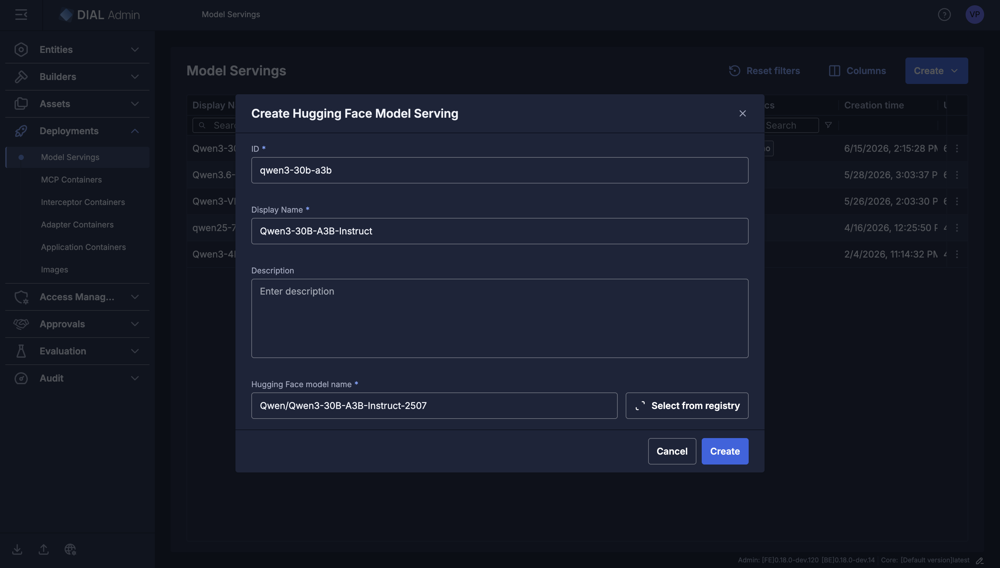
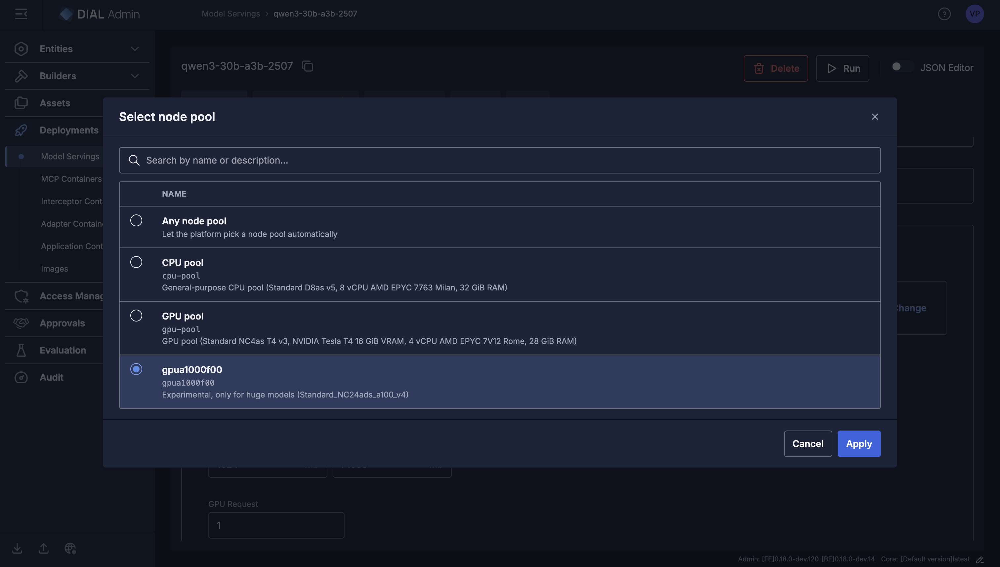
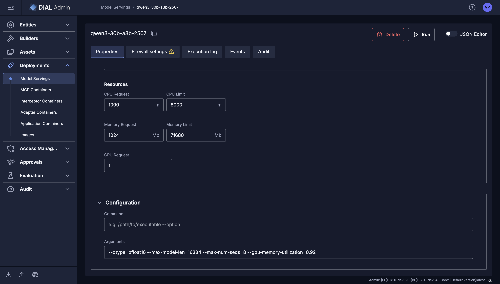
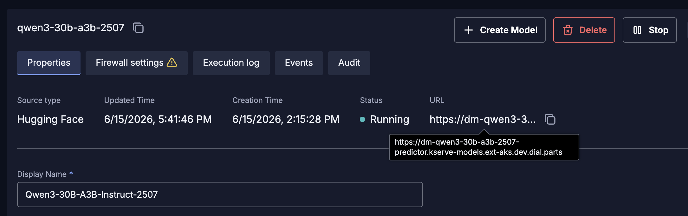
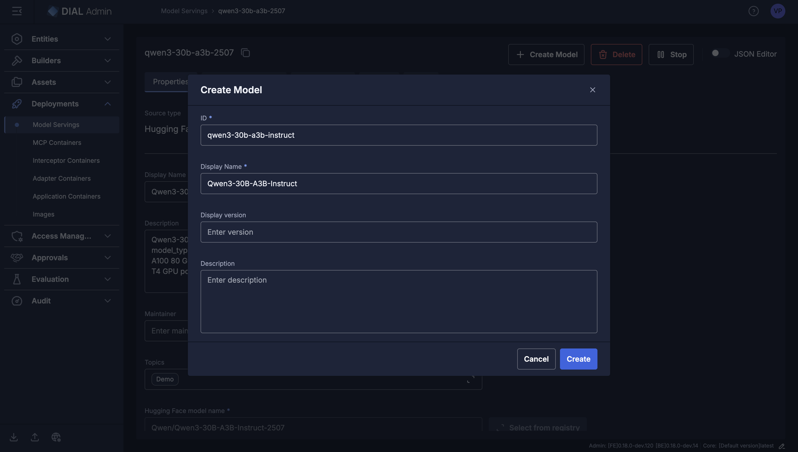
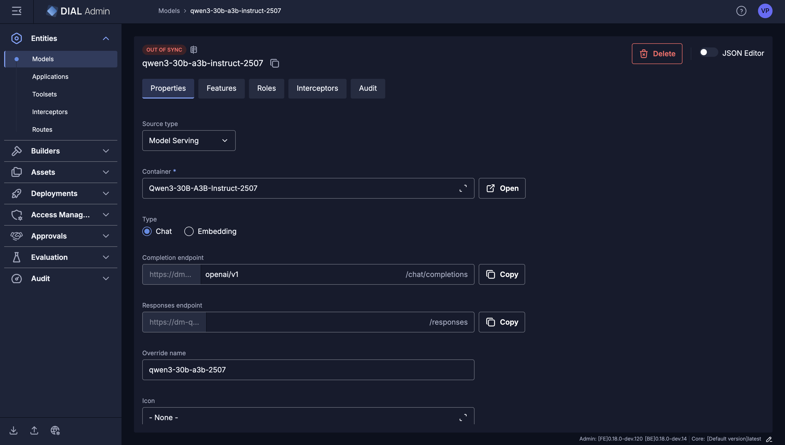
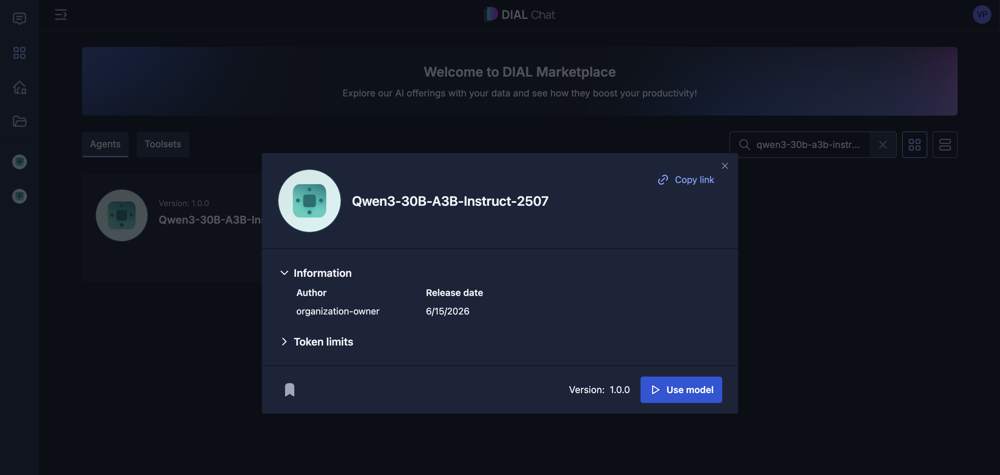
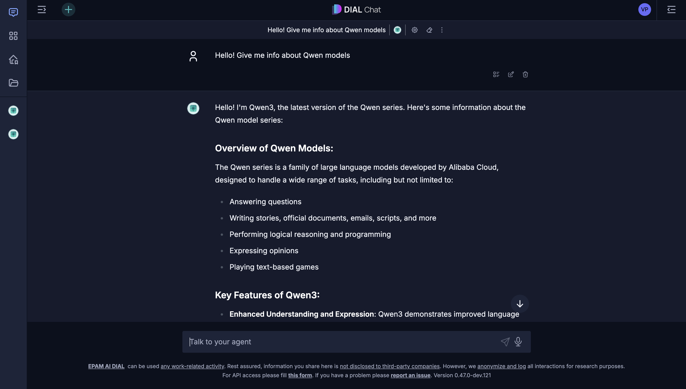

# Demo runbook: deploying open-weight LLMs via Deployment Manager

**What this demo shows:** standing up a current open-weight LLM through DM's Inference (KServe) path — from
deployment creation to a live, chat-callable endpoint — **with no engineering pairing**.
The flow is the same for any model whose architecture the shared serving runtime already
supports; only the model name, GPU pool, and a couple of serving args change.

The worked example is `Qwen/Qwen3-30B-A3B-Instruct-2507`; a second vendor family
(`google/gemma-3-27b-it`) is covered under [Verified models](#verified-models) as a contrast.

Run order for a live demo: walk [Procedure A](#procedure-a--deploy-from-the-dial-admin-ui)
top to bottom on the screen, using [Cold-start timing](#cold-start-timing-measured) to set
expectations during the wait and [Troubleshooting](#troubleshooting) if anything stalls.

## Pros for the operator

The value the demo is meant to make tangible — what DM gives the person who actually wants the
model:

- **Self-service.** No DevOps ticket per model deploy. The operator who *wants* a model deploys
  it themselves instead of filing a request and waiting for a platform engineer to pick it up.
- **Time-to-deploy collapses.** What used to be a days-long cross-team flow (ticket → image build
  → review → cluster apply → DIAL wiring) becomes a few minutes in one UI — work blocked on
  "still waiting on the deploy" unblocks the same afternoon.
- **Frees the platform team.** Engineering cycles stop being spent on one-off model deploys, so
  the platform team works on platform problems instead of being a deploy queue.
- **No image build, no hand-rolled Kubernetes YAML.** The two surfaces that today require
  Kubernetes literacy to debug are gone — the operator never sees a manifest or a Dockerfile.
- **Day-2 story comes for free.** The same lifecycle controls as any other DM deployment —
  status, pod introspection, logs, scaling, audit history, revision rollback — so self-service
  doesn't cost operability.
- **One control plane, many vendors.** Qwen (Alibaba), Gemma (Google), and the rest live behind
  the same UI, credentials, and observability surface — no per-vendor silos and no parallel
  runbooks to keep in sync. Trying another vendor's flagship costs "paste another model name",
  not "spin up another integration project".
- **Cheap experimentation across vendors.** Operators can A/B one model against another on a real
  workload without negotiating engineering time per vendor — better model choices arrive faster.
- **Vendor gotchas surface early.** Chat-template, tokenizer, and served-model-name quirks show
  up during a cheap deploy, captured as one [Troubleshooting](#troubleshooting) row each, rather
  than in production.

## Talking points to land

Two independent requirements — a deployment succeeds only when **both** hold, and they fail
differently:

| Requirement | Provided by | Failure signature |
|---|---|---|
| **Hardware** — enough GPU memory for weights + KV cache | The node pool you select | OOM at load, or `FailedScheduling … Insufficient nvidia.com/gpu`, or vLLM aborts its startup KV-cache check |
| **Software** — runtime recognises the model architecture | The shared KServe serving runtime | Container crashes immediately on load: `KeyError` / `unrecognized model_type …` |

A bigger GPU never fixes a software/architecture gap, and vice-versa. Keep the two separate
when diagnosing. This split is also why the day-0 release case isn't demoable today — see
[Why the release-day scenario isn't in this demo](#why-the-release-day-scenario-isnt-in-this-demo).

### Available GPU pools on DEV env

The pools below are the ones configured on the **DEV** environment. Node-pool configuration
(names, GPU types, VRAM, scaling) differs between environments — confirm what's available on
the env you're demoing against before relying on a specific pool name like `gpua1000f00`.

- **GPU pool (T4, 16 GiB)** — default. No native bf16, so weights auto-upcast to fp32
  (`params × 4 bytes`); fine for small models only.
- **`gpua1000f00` (A100 80 GB)** — *"Experimental, only for huge models"*. Scales from zero
  (~5 min cold start) and has native bf16. This is the pool both verified models use.

### Sizing in one breath

1. **Resident weight size** ≈ `params × 2 bytes` (bf16). On the T4's fp32 path it doubles.
2. **KV cache = `--gpu-memory-utilization × VRAM` minus weights, CUDA context, activations.**
3. vLLM **aborts at startup** if the KV remainder can't hold one `--max-model-len` sequence.
   This bites the *largest dense* models. Mitigate by lowering `--max-model-len`, raising
   utilization, or picking a **Mixture-of-Experts** model (large total weights, small
   per-token KV footprint — the route taken below).

## Procedure A — Deploy from the DIAL Admin UI

The operator self-service flow, under **DIAL Admin → Deployments → Model Servings**. Screens
captured on Admin `[FE] 0.18.0-dev.120` / `[BE] 0.18.0-dev.14`.

### Step 1 — Create the Model Serving

**Deployments → Model Servings → Create → Hugging Face Model Serving.** In the dialog set:

- **ID** — lowercase-kebab, 2–36 chars, `^[a-z0-9-]+$` (e.g. `qwen3-30b-a3b-2507`).
- **Display Name** (e.g. `Qwen3-30B-A3B-Instruct`).
- **Description** (optional).
- **Hugging Face model name** — the repo id, e.g. `Qwen/Qwen3-30B-A3B-Instruct-2507`, or use
  **Select from registry**.

Click **Create**. The model source lives in this dialog — there is no separate source step.



### Step 2 — Select the GPU node pool

On the new serving's **Properties** page, open **Compute → Node pool → Change** and choose the
pool that fits the model. For the ~24–32B tier pick **`gpua1000f00`** (the A100 80 GB pool); the
other options are *Any node pool*, *CPU pool*, and the T4 *GPU pool*. Click **Apply**.



### Step 3 — Resources and serving args

Still on **Properties → Compute**:

- **Resources** — CPU in millicores, memory in Mb. Example: CPU Request `1000` m / Limit
  `8000` m; Memory Request `1024` Mb / **Limit `71680` Mb (≈70 GiB)**; **GPU Request `1`**. Set
  the memory limit **≥ resident weight size** — the default is far too low to load an LLM.
- **Configuration → Arguments** (vLLM flags); leave **Command** empty:
  ```
  --dtype=bfloat16 --max-model-len=16384 --max-num-seqs=8 --gpu-memory-utilization=0.92
  ```
  What each flag does:
  - `--dtype=bfloat16` — load weights in bf16 (`params × 2 bytes`). Needs an Ampere+ GPU
    (the A100 pool); on the T4 drop this and weights upcast to fp32. Omit to let vLLM pick
    from the model config.
  - `--max-model-len=16384` — max context (prompt + output) per request. Drives KV-cache
    size: bigger = more VRAM per sequence. Lower it if the startup KV-cache check fails.
  - `--max-num-seqs=8` — how many requests vLLM batches concurrently. Higher = more
    throughput but more KV-cache pressure; 8 is a safe demo default.
  - `--gpu-memory-utilization=0.92` — fraction of GPU VRAM vLLM may use (0–1). The KV cache
    is what's left after weights + CUDA context; raise toward `0.95` to free more for KV,
    lower if you hit OOM at load.
- Optional: set `PYTORCH_CUDA_ALLOC_CONF=expandable_segments:True` in the environment-variables
  section, and review **Firewall settings** (outbound allow-list) if your cluster restricts
  egress to HuggingFace.



### Step 4 — Run and wait for RUNNING

Click **Run** to deploy. The first cold deploy on a scale-from-zero pool is slow; track progress
on the **Events** tab while the status moves `PENDING → RUNNING` (the `FailedScheduling` and
readiness-probe noise during this window is expected — see
[Cold-start timing](#cold-start-timing-measured) and [Troubleshooting](#troubleshooting)). On
**RUNNING**, the Properties header shows the live status and the internal predictor **URL**
(`https://dm-<id>-predictor.<namespace>.<cluster>`), and a **Create Model** button appears
beside **Stop** / **Delete**.



### Step 5 — Create the DIAL model

Click **Create Model**. The popup's **source is auto-set to this serving** (the Hugging Face
model name is pre-filled and read-only), so you only confirm the catalogue metadata:

- **ID** (e.g. `qwen3-30b-a3b-instruct`) and **Display Name** — what users see in chat.
- Optional **Display version**, **Description**, **Maintainer**, **Topics** (e.g. `Demo`).

Click **Create**.



The resulting model entity (**Entities → Models**) has **Source type: Model Serving**, its
**Container** pointing at the serving, and the completion/responses endpoints **auto-wired** — no
URLs or keys entered by hand. Ensure **Type** is `Chat`.



### Step 6 — Use it in DIAL Chat

Open **DIAL Chat → Marketplace**, search for the model, open its card, and click **Use model**.



Start a conversation to confirm the path works end-to-end. (In the demo run, the model correctly
self-identifies as Qwen3 — proof the live serving, not a cached entry, is answering.)



### Step 7 — Teardown

**Stop** the serving when done — the GPU node scales back down once no pod needs it, and the
serving and model records are retained and re-runnable. **Delete** removes the serving entirely.
Failed experiments cost only the cold-start time.

## Cold-start timing (measured)

Honest numbers from the first **cold** run of `Qwen/Qwen3-30B-A3B-Instruct-2507` (A100 pool at
**zero nodes**, no cached weights, no cached runtime image). Use these to set expectations while
the demo waits on **RUNNING**.

| Phase | Duration | Notes |
|---|---|---|
| Node scale-from-zero + schedule | ~5m28s | A100 pool was at 0 nodes; autoscaler provisioned 1 (`FailedScheduling` churn during this window is expected) |
| Weight download (storage-initializer, ~61 GiB) | ~7m50s | no weights cache today → re-paid on every cold node |
| Runtime image pull (KServe `huggingfaceserver`, ~9.96 GB) | ~3m42s | not yet cached on the fresh node |
| vLLM load + CUDA-graph capture + warmup | ~5m32s | until the readiness probe passes |
| **End-to-end (deploy → RUNNING), cold** | **~22m38s** | |

Redeploying onto an **already-up node** skips the two infrastructure phases: node
scale-from-zero (~5.5 min) and the runtime image pull (the image stays in the node's local
kubelet image cache). It does **not** skip the weight download — there's no weights cache in
the infra today (no PVC; tracked as a follow-up), so the storage-initializer re-downloads
~61 GiB into the new pod every time. A warm-node redeploy is therefore still roughly
weight download + load + warmup (~13 min), not the load phase alone.

Tip for a live audience: don't tear the serving down between rehearsal and the demo — keep it
**RUNNING** so there's nothing to re-download or reload at all. If you must redeploy, at least
keep the node warm to skip scale-up and the image pull.

## Verified models

| Model | Family / `model_type` | Params | License | Node pool | Status |
|---|---|---|---|---|---|
| `Qwen/Qwen3-30B-A3B-Instruct-2507` | Qwen3 MoE / `qwen3_moe` | 30.5B total / 3B active | Apache-2.0 (ungated) | `gpua1000f00` (A100 80 GB) | ✅ RUNNING (cold-start measured) |
| `google/gemma-3-27b-it` | Gemma 3 / `gemma3` (multimodal) | 27B dense | Gemma license (**gated**) | `gpua1000f00` (A100 80 GB) | ✅ RUNNING |

### Model 1 — `Qwen/Qwen3-30B-A3B-Instruct-2507`

A reliable first proof of the ~24–32B tier: large resident weights (~61 GiB bf16 → requires the
A100 pool, will not fit a 16 GiB T4), ungated, and an MoE architecture
whose small per-token KV footprint deploys comfortably at the default `--max-model-len=16384`
with no arg tuning.

Result: reached `RUNNING` first try; `restartCount: 0`, no OOM, no crash; predictor URL
`https://dm-qwen3-30b-a3b-2507-predictor.kserve-models.ext-aks.dev.dial.parts`. Published to DIAL
via **Create Model** and verified end-to-end from DIAL Chat (the model self-identifies as Qwen3).

### Model 2 — `google/gemma-3-27b-it`

A **different vendor family** (Google vs Qwen) and a **dense** model (vs MoE), proving the
"one control plane, many vendors" path. It also exercises two paths Model 1 did not: a **gated**
repo, and a **multimodal** architecture (`Gemma3ForConditionalGeneration`, served text-only here).
Resident weights ~54 GiB bf16 → requires the A100 pool; will not fit a 16 GiB T4 (and Gemma 3
additionally rejects fp16, so the T4's fp32-upcast path is doubly out).

Result: reached `RUNNING`; `restartCount: 0`, no OOM, no crash. vLLM (v0.19.0) logged
`Resolved architecture: Gemma3ForConditionalGeneration`, `dtype=torch.bfloat16`,
`Using max model len 32768`, loaded all `12/12` safetensors shards, and reported
`Model loading took 51.45 GiB`. End-to-end on a fully cold pool was ≈15 min. Predictor URL
`https://dm-gemma-3-27b-it-predictor.kserve-models.ext-aks.dev.dial.parts`.

Vendor/model gotchas worth narrating in the demo:

- **`--max-model-len` is required here, not optional.** Gemma 3 advertises a 131 K context; at
  the default vLLM sizes the KV cache for the full window and the startup KV-cache check fails
  even on 80 GB. `--max-model-len=32768` is ample for chat and loads cleanly. Unlike Model 1,
  bf16 did **not** need to be forced — vLLM auto-selected it (the A100 has native bf16).
- **Multimodal arch, served as text.** vLLM logs a `Forcing --disable_chunked_mm_input` warning
  and profiles an image encoder; text completion works normally.

## Why the release-day scenario isn't in this demo

A natural ask is "deploy the latest open-weight model the day it drops." We deliberately don't
demo this, because a **day-0 frontier release** can hit the *software* requirement above even when
the *hardware* is fine.

A current example is **Qwen 3.6**, whose `qwen3_5` architecture was introduced only in Hugging
Face Transformers **v5.x (Feb 2026)** — newer than the libraries baked into the shared serving
runtime, and not yet fully adopted by vLLM. The runtime can't recognise the architecture, so the
container crashes immediately on load (`unrecognized model_type`) regardless of how big a GPU you
give it. The A100 upgrade satisfies hardware; it does nothing for this software gap.

Key framing for the audience:

- **Not a per-model bottleneck.** The fix is a single, platform-wide runtime update performed
  **once per runtime version** — after which *every* model of that architecture (all Qwen 3.5/3.6
  variants) is self-service indefinitely. It is not DevOps-per-model.
- **Industry-wide, not DM-specific.** No inference software can run a model whose architecture
  didn't exist when that software was built; a hand-rolled vLLM deployment hits the identical
  wall. DM stays fully self-service for any model the runtime already supports — the vast
  majority, including most recent releases.
- **Timeline depends on upstream.** The gap closes once Transformers 5.x is fully adopted by
  vLLM and folded into the platform runtime — a routine update, not bespoke per-model work.
  Keeping the runtime on a regular upgrade cadence (and, optionally, letting advanced users
  target a newer runtime) shortens or eliminates this lag for future releases.

## Troubleshooting

| Symptom | Meaning | Action |
|---|---|---|
| `FailedScheduling … untolerated taint` / `Insufficient nvidia.com/gpu` early on | Autoscaler is still provisioning a node (scale-from-zero) | Wait — normal for the first few minutes on an idle pool |
| **Persistent** `FailedScheduling … untolerated taint {nvidia.com/gpu: true}` + `NotTriggerScaleUp` (never resolves) | No GPU was requested, so k8s' `ExtendedResourceToleration` never adds the GPU-taint toleration and the autoscaler won't grow the GPU pool | Set **`nvidia.com/gpu: 1`** in resources (both requests and limits). Omitting `resources` entirely drops the GPU request — always include it. Memory must be in **bytes**, not `Gi` |
| `Readiness probe failed: context deadline exceeded` (repeating) | vLLM is still loading weights / capturing CUDA graphs | Wait — benign while `restartCount` stays 0 and there's no crash |
| Container exits immediately, `unrecognized model_type` / `KeyError` | **Software gap**: runtime libraries predate the architecture | Not a sizing issue — needs a runtime update; see [Why the release-day scenario isn't in this demo](#why-the-release-day-scenario-isnt-in-this-demo) |
| vLLM aborts: "max seq len … larger than … KV cache" | Weights leave too little KV budget | Lower `--max-model-len`, raise `--gpu-memory-utilization`, or pick an MoE — see [Sizing](#sizing-in-one-breath) |
| Download fails / 401 / "gated repo" | Gated HF repo with no accepted-license token in the runtime | Use an ungated model, or have the runtime configured with an accepting HF token |
| CUDA OOM at load | Weights + KV exceed VRAM | Smaller model, bigger pool, lower `--max-model-len`, or quantized variant |
| `gemma3` / similar rejects `--dtype=half` | Per-model-type fp16 guard | Use bf16 (needs Ampere+) or fp32 |
</content>
</invoke>
